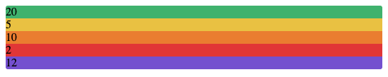
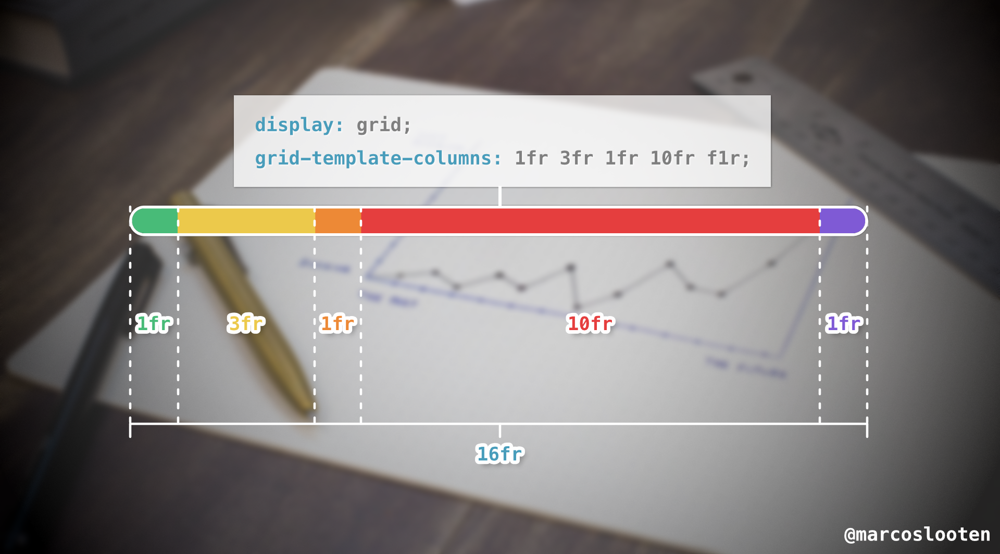

I was recently asked to build a (percentage) stacked bar chart. This type of chart is an alternative to the classic pie chart. One of the advantages is that it takes up way less space in one direction. This is what we will build:


Now you could try to make this with an existing chart library, but that feels like overkill. Besides, it's simpler to roll our own in this case. And we get to use a cool 'trick' with CSS Grid! 🔥

## Building the chart basics

Let's say we want to track which types of fruit are consumed in the office and how popular they are. First, create some HTML:

```html
<div id="fruit-meter">
  <div id="apples">20</div>
  <div id="bananas">5</div>
  <div id="peaches">10</div>
  <div id="cherries">2</div>
  <div id="grapes">12</div>
</div>
```

For each type of fruit I have a div with the absolute number of those sold, and a wrapper with an id of 'fruit-meter'. The mathematicians amongst us will have noticed these numbers don't add up to 100. Don't panic, that's the point: we're going to fix it with grid later. For now, let's start by giving these boring divs some color (I took these HEX codes from Tailwind CSS, which I used to prototype this):

```css
#fruit-meter {
  border: 2px solid white;
  border-radius: 5px;
  overflow: hidden;
}

#apples {
  background: #48bb78;
}

#bananas {
  background: #ecc94b;
}

#peaches {
  background: #ed8936;
}

#cherries {
  background: #e53e3e;
}

#grapes {
  background: #805ad5;
}
```

I'm giving the wrapper div ('#fruit-meter') a white border (useful when used on darker backgrounds), a border radius and an overflow of hidden. The last bit is so that it will also round the corners of the colored divs, which otherwise will stick out.

Right now, it should look something like this:



## Use CSS Grid to create a horizontal layout

Time to see what CSS Grid can do for us.

```css
#fruit-meter {
  border: 2px solid white;
  border-radius: 10px;
  overflow: hidden;
  /* New code below: */
  display: grid;
  grid-template-columns: 1fr 1fr 1fr 1fr f1r;
}
```

OK, so now it's starting to look like a stacked bar chart. `display: grid` enables grid styling. `grid-template-columns` is responsible for creating columns in our grid. I've added 5 columns (or _tracks_) with a size of '1fr' each.

`fr` stands for fraction and it is calculated by CSS Grid. It divides the available width by the sum of all fractions I've defined. That will be the width of '1fr'. So the above code means that all columns will have 20% of the available width as their size.

If I would have had three columns and `grid-template-columns: 2fr 2fr 1fr`, that would still add up to 5 and it would result in two columns of 40% width each, and one of 20% width.

Here's another example where you can visualize how grid works:


You may have noticed something useful: normally we would have to calculate the percentages in order to get the correct widht. Now, we can let CSS Grid calculate that! I can write `grid-template-columns: 23fr 70fr 10fr 123fr` and it will work just fine. So let's put the number of fruits sold in fractions:

```css
grid-template-columns: 20fr 5fr 10fr 2fr 12fr;
```

Lastly, let's style those numbers a bit (or leave them out of your HTML entirely, up to you!):

```css
#fruit-meter div {
  color: white;
  font-family: sans-serif;
  font-weight: bold;
  font-size: 12px;
  line-height: 20px;
  display: flex;
  align-items: center;
  justify-content: center;
}
```

If you followed along, you should end up with this cool stacked bar chart:


## Conclusion

CSS Grid can be used to help you make (stacked) bar charts pretty easily. The magic lies in using the raw numbers as the fractions (`fr` units) in grid-template-columns to automatically size them. After making this chart, a vertical one is pretty easy too (just replace `grid-template-columns` with `grid-template-rows` and give the wrapper a certain width)! What other creative uses for CSS Grid can you think of?
